# 📣 Broadcast WhatsApp Bot

<div align="center">


[](https://opensource.org/licenses/MIT)
[](https://nodejs.org/)
[](http://makeapullrequest.com)

**Bot WhatsApp otomatis untuk mendeteksi link grup, menyimpan ke database, dan melakukan broadcast pesan**

[Fitur](#-fitur) • [Instalasi](#-instalasi) • [Penggunaan](#-penggunaan) • [Kontribusi](#-kontribusi)

</div>

---

## 🎯 Tentang Project

Bot WhatsApp otomatis yang dibangun menggunakan [Baileys](https://github.com/WhiskeySockets/Baileys) untuk:

- 🧲 **Deteksi Otomatis**: Mendeteksi & menyimpan link grup WhatsApp dari pesan masuk
- 📤 **Notifikasi Admin**: Mengirim link grup ke admin setelah mencapai ambang batas
- 📢 **Broadcast**: Mengirim pesan teks ke semua grup yang tergabung
- 🛡️ **Anti-Spam**: Delay acak antar pengiriman untuk menghindari deteksi

---

## ✨ Fitur

<table>
  <tr>
    <td align="center">🔍</td>
    <td><strong>Deteksi Link Grup</strong><br>Otomatis mendeteksi link <code>https://chat.whatsapp.com/...</code></td>
  </tr>
  <tr>
    <td align="center">💾</td>
    <td><strong>Penyimpanan Database</strong><br>Simpan ke SQLite menggunakan Sequelize ORM</td>
  </tr>
  <tr>
    <td align="center">🚨</td>
    <td><strong>Notifikasi Threshold</strong><br>Kirim ke admin jika jumlah link ≥ <code>GROUP_THRESHOLD</code></td>
  </tr>
  <tr>
    <td align="center">📢</td>
    <td><strong>Broadcast Teks</strong><br>Perintah <code>/bcast</code> untuk broadcast ke semua grup</td>
  </tr>
  <tr>
    <td align="center">⏱️</td>
    <td><strong>Delay Acak</strong><br>Mencegah deteksi spam dengan jeda yang bervariasi</td>
  </tr>
</table>

---

## 🛠️ Tech Stack

<div align="center">

| Teknologi | Deskripsi | Version |
|-----------|-----------|---------|
|  | Runtime JavaScript | v18+ |
|  | WhatsApp Web API Client | Latest |
|  | ORM untuk Database | Latest |
|  | Database Lokal | Latest |
|  | Containerization | Optional |

</div>

---

## 📦 Instalasi

### 🚀 Instalasi Manual

#### 1️⃣ Clone Repository

```bash
git clone https://github.com/username/broadcast-whatsapp.git
cd broadcast-whatsapp
```

#### 2️⃣ Install Dependencies

> **💡 Tip**: Gunakan PNPM untuk performa yang lebih baik!

<details>
<summary>🟢 PNPM (Recommended)</summary>

```bash
pnpm install
```
</details>

<details>
<summary>🔵 NPM</summary>

```bash
npm install
```
</details>

<details>
<summary>🟠 Yarn</summary>

```bash
yarn install
```
</details>

#### 3️⃣ Konfigurasi Environment

Buat file `.env` di root directory:

```env
# 🔑 Konfigurasi Admin
ADMIN_JID=628xxxxxxxxxx@s.whatsapp.net

# 📊 Pengaturan Threshold
GROUP_THRESHOLD=5

# ⏰ Pengaturan Delay (milliseconds)
DELAY_MIN=10000
DELAY_MAX=60000
```

> **📋 Penjelasan Variabel:**
> - `ADMIN_JID`: Nomor WhatsApp admin (format JID)
> - `GROUP_THRESHOLD`: Jumlah link minimal sebelum dikirim ke admin
> - `DELAY_MIN/MAX`: Range delay acak antar broadcast

#### 4️⃣ Jalankan Bot

```bash
pnpm start    # atau npm start / yarn start
```

---

### 🐳 Instalasi via Docker

#### 1️⃣ Build & Run Container

```bash
docker compose up -d --build
```

#### 2️⃣ Verifikasi Container

```bash
docker ps
docker logs broadcast-whatsapp
```

> **⚠️ Penting**: Pastikan file `.env` sudah ada di direktori root sebelum menjalankan Docker!

---

## 📁 Struktur Project

```
broadcast-whatsapp/
├── 📁 auth/                   # Sesi login Baileys (auto-generated)
├── 📁 models/
│   └── 📄 GroupLink.js        # Model Sequelize untuk link grup
├── 📄 index.js                # Entry point utama
├── 📄 .env                    # Konfigurasi environment
├── 📄 Dockerfile              # Docker build configuration
├── 📄 docker-compose.yml      # Docker compose setup
├── 📄 package.json            # Dependencies & scripts
└── 📄 README.md               # Dokumentasi ini
```

---

## 🎮 Penggunaan

### 👑 Perintah Admin

| Perintah | Deskripsi | Status |
|----------|-----------|---------|
| `/bcast` | Mulai sesi broadcast | ✅ Available |
| `/cancel` | Batalkan sesi broadcast | ✅ Available |

### 🔄 Workflow Bot

```mermaid
graph LR
    A[Pesan Masuk] --> B{Mengandung Link Grup?}
    B -->|Ya| C[Simpan ke Database]
    B -->|Tidak| D[Abaikan]
    C --> E{Jumlah ≥ Threshold?}
    E -->|Ya| F[Kirim ke Admin]
    E -->|Tidak| G[Tunggu Link Berikutnya]
    F --> H[Reset Counter]
```



### 🧲 Contoh Link yang Terdeteksi

```
https://chat.whatsapp.com/ABCdefGHIjklMNOpqrstuv
https://chat.whatsapp.com/XYZ123abc456DEF789ghi
```

---

## 🤝 Kontribusi

Kontribusi sangat diterima! Berikut cara berkontribusi:

1. **Fork** repository ini
2. **Create** branch fitur (`git checkout -b feature/AmazingFeature`)
3. **Commit** perubahan (`git commit -m 'Add some AmazingFeature'`)
4. **Push** ke branch (`git push origin feature/AmazingFeature`)
5. **Open** Pull Request

### 🎯 Roadmap Fitur

- [ ] 📸 Broadcast media (gambar/file)
- [ ] 📅 Limitasi harian broadcast
- [ ] 🗄️ Support database lain (PostgreSQL, MySQL)
- [ ] 🖥️ Dashboard UI untuk monitoring
- [ ] 📊 Analytics dan statistik
- [ ] 🔒 Sistem autentikasi admin
- [ ] 📱 Webhook notifications

---

## 📊 Stats

<div align="center">


</div>

---

## 📄 Lisensi

Distributed under the MIT License. See `LICENSE` for more information.

```
MIT License - Bebas digunakan, dimodifikasi, dan dibagikan.
Jangan lupa berikan atribusi yang sesuai! 🙏
```

---

## 👨‍💻 Author

<div align="center">

**🛰️ Xenvoid 404**

[](https://github.com/username)
[](https://twitter.com/username)
[](https://linkedin.com/in/username)

</div>

---

<div align="center">

**⭐ Jika project ini membantu, berikan star ya! ⭐**

**💬 Ada pertanyaan? Silakan buka [Issues](https://github.com/username/broadcast-whatsapp/issues)**

---

*Made with ❤️ by Xenvoid 404*

</div>